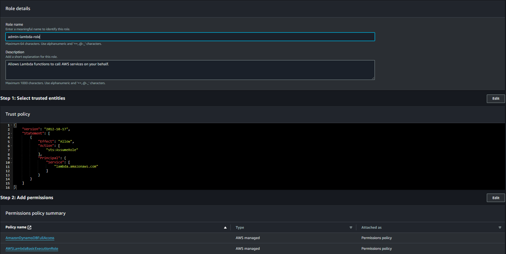
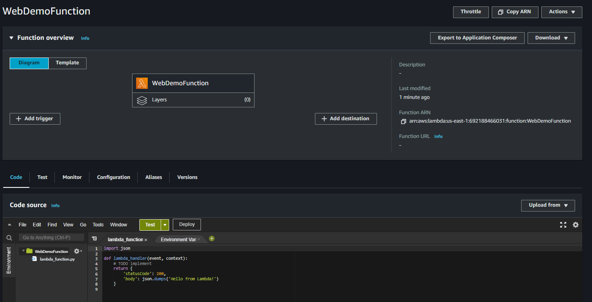
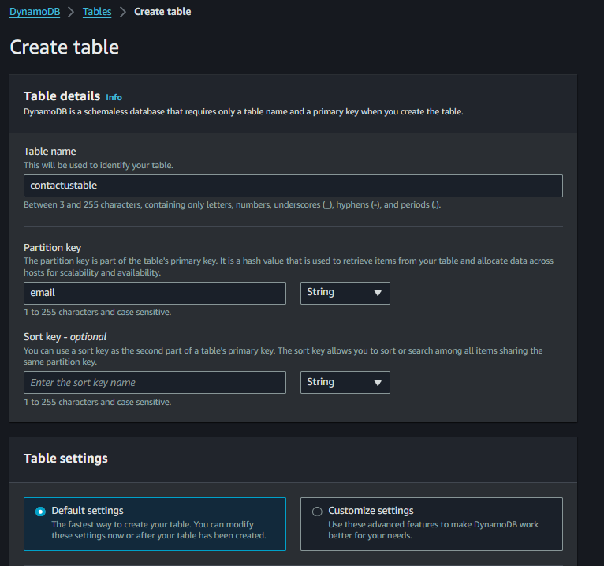
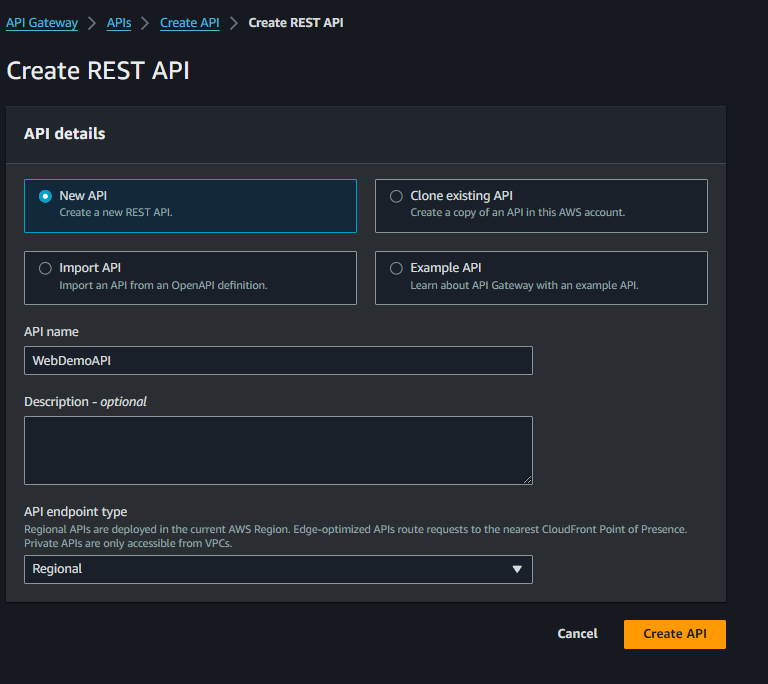
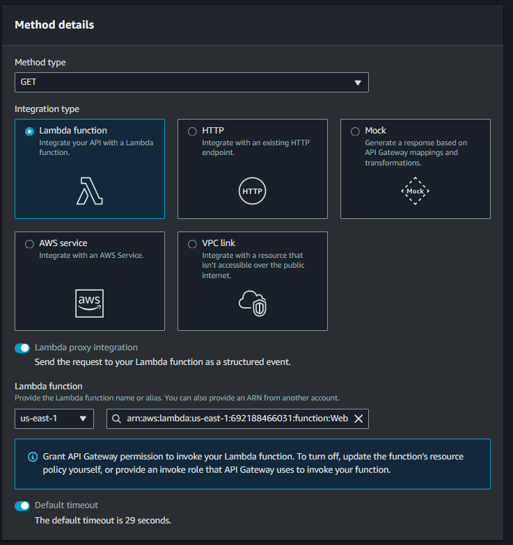
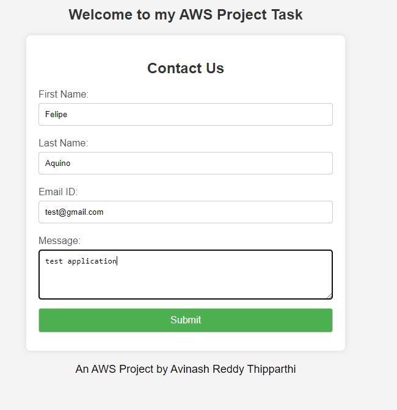
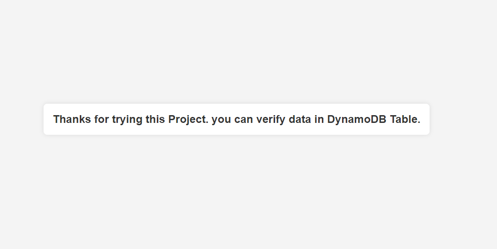
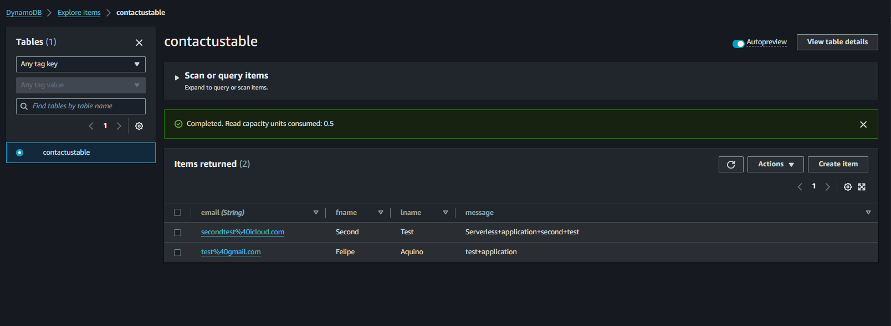

# Serverless Application README

This repository contains a serverless application built on AWS utilizing IAM, API Gateway, AWS Lambda, and DynamoDB. The application allows users to interact with a RESTful API where requests are processed by AWS Lambda functions written in Python and store information in a DynamoDB table.

## IAM ROLE for Lambda and DynamoDB

An IAM role is created to grant necessary permissions for Lambda and DynamoDB.

## Creating Lambda Function

The process of creating a Lambda function for the application.

## Creating DynamoDB Table

Steps to create a DynamoDB table named "contactustable" with the partition key as "email".

## Creating API Gateway

Setting up API Gateway for the application.

### Method Types for API

#### GET Method

#### POST Method

Illustrating the creation of methods (GET and POST) for the API.

## Testing Application

Guidelines for testing the application after setup.

### Successful Message

Confirmation message for successful execution.

## Checking DynamoDB Table

Instructions for validating and checking the DynamoDB table.
